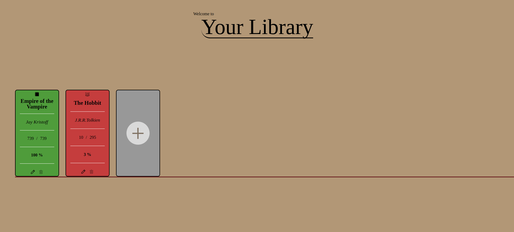

# Library

## Summary



This project creates a fully functional digital library to track books you’ve read or are currently reading. The library supports adding, editing, and removing book entries, with each book stored locally in your browser. Built using OOP principles, it has two sample books (The Hobbit and Empire of the Vampire) as examples before you add your own.

## Features

- **CRUD Functionality**: Add, edit, and delete book entries dynamically.
- **Input Validation**: Validates page numbers and completion percentages for accurate tracking.
- **Lightweight, Responsive Design**: Built with vanilla CSS, HTML, and JavaScript.

## Setup

To get started with this project, follow the steps below:

### 1. Fork the Repository

First, you need to fork this repository to your GitHub account by clicking the "Fork" button near the top right of this page. If you are unfamiliar with this process, please follow this GitHub [guide](https://docs.github.com/en/pull-requests/collaborating-with-pull-requests/working-with-forks/fork-a-repo).

### 2. Clone the Repository

Next, clone the repository to your local machine using the following command. Make sure to replace `your-username` with your GitHub username:

```
git clone https://github.com/your-username/tic-tac-toe
```

### 3. Running the File

Once cloned, navigate to your project folder, locate the HTML file, and double-click it. This should open the file in your default browser.

Alternatively, if you're using Visual Studio Code, you can install the "Live Server" extension and use it to launch the project by right-clicking on the HTML file and selecting **Open with Live Server**.

### 4. Have Fun

Feel free to add or delete books and experiment with the code to further understand how it all works.

## Features and Functionality

**Book Class**: Each book entry is an instance of the Book class, storing details like title, author, total pages, pages read, and finished status.
**Data and UI Setup**: The UI includes a modal for adding or editing books, buttons for saving or closing, and form fields that validate user inputs.
**Form Validation and Error Handling**: Validation ensures that the entered pages read are within total pages and that all form fields are completed before enabling the "Save" button.
**Add, Edit, and Remove Books**: Add new books or update existing ones. A unique bookIndex tracks each book, and the index adjusts after deletions to keep entries consistent.
**Dynamic Book Display**: Each book is rendered on a "shelf," displaying progress visually. Each entry has options to edit, remove, or mark as read/unread.
**Modular Helper Functions**: Helper functions manage tasks like resetting forms, validating entries, and updating the library view.

This code provides an interactive, user-friendly experience for managing your reading list while demonstrating OOP principles, DOM manipulation, and dynamic rendering.